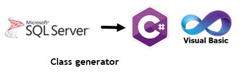
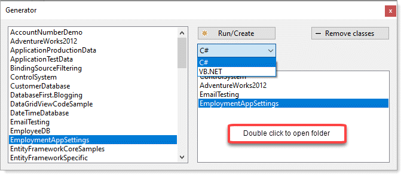
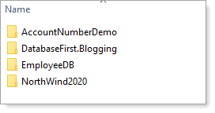
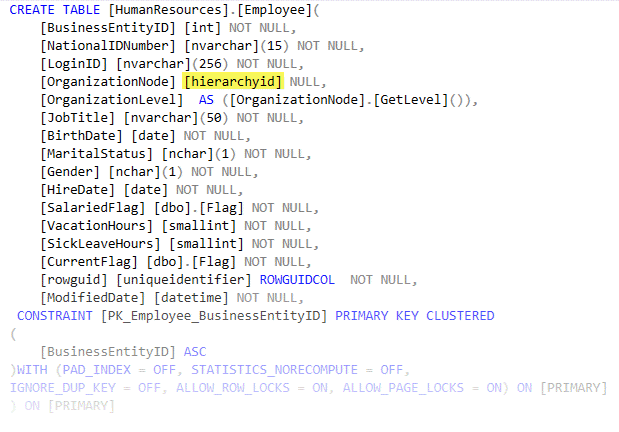

# About



Supports VB.NET and C# (written in C#)



Code presented here provide methods to `create concrete classes` from `SQL-Server database tables` written with Microsoft Visual Studio 2019, C#, .NET Core 5.

When use of conventional DataSet/DataTable to store data are too heavy, similarly Entity Framework is overkill creating simple classes can be a great solution. 

When there are a handful of columns in a database table it's easy to hand code a class with properties to store data while a table with many columns may be cumbersome to write by hand. 

Within this repository is a Windows Form project which creates concrete classes for a select database.

# How to use

* In the form load event in the project `CreateClassesFromSqlServer` change the server name if not using SQL-Express edition of SQL-Server to your server name.

```csharp
DataOperations.Server = ".\\SQLEXPRESS";
```

* Set the project `CreateClassesFromSqlServer` as the startup project
* Build the project `CreateClassesFromSqlServer`
* Start the project
* Select a database in the listbox
* Click Run/Create button

Once clicking the Run/Create button a folder is created under the application folder named Classes, the classes are create under `Classes\DatabaseNamme`.

Example



Copy all or required classes to your project and add a namespace if so desired.


Originally written to answer a stackoverflow [question](https://stackoverflow.com/questions/68225326/how-to-create-a-models-class-from-sql-server) to Declarate each 
property with a specific property attribute using a select statement found in `ClassQuery.txt`. Have changed to the code to exclude the property attribute using a 
query in `ClassQueryPlain.txt`

No guarantees that the code fits all situations

# Test project

The project `DataLibraryTestProject` uses one of the classes generated with the addition of editing the class and adding a namespace.

# Requires

- Visual Studio 2019 or higher
- NuGet package [System.Data.SqlClient](https://www.nuget.org/packages/System.Data.SqlClient/)

# Important

In some cases the type for a property may not be known and in these cases will have `UNKNOWN` prepended to the SQL-Server type. In these cases a conversion will be needed.

For example [hierarchyid] needs to be parses using [SqlHierarchyId.Parse](https://docs.microsoft.com/en-us/previous-versions/sql/sql-server-2008-r2/ee642858(v=sql.105)?redirectedfrom=MSDN) via a read-only property.




# Note

Base code from a [Stackoverflow post](https://stackoverflow.com/questions/5873170/generate-class-from-database-table) to a response for a [question](https://stackoverflow.com/questions/68225326/how-to-create-a-models-class-from-sql-server).


